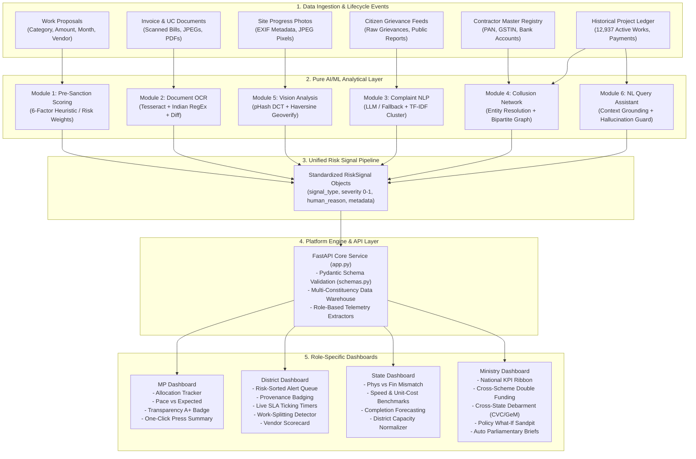

# MPLADS AI/ML Intelligence & Risk Operations Platform
### Comprehensive Architecture, Data Flow, Feature Engineering & API Reference Manual

---

## Table of Contents
1. [Executive Summary & Platform Purpose](#1-executive-summary--platform-purpose)
2. [End-to-End System Architecture & Lifecycle Flow](#2-end-to-end-system-architecture--lifecycle-flow)
   - [Architectural Flow Diagram](#architectural-flow-diagram)
   - [Order of Execution Across the Project Lifecycle](#order-of-execution-across-the-project-lifecycle)
3. [The Uniform Risk Signal Pipeline (`common/types.py`)](#3-the-uniform-risk-signal-pipeline-commontypespy)
4. [Exhaustive Feature-by-Feature Deep Dive](#4-exhaustive-feature-by-feature-deep-dive)
   - [Module 1: Predictive Pre-Sanction Scoring (`presanction_scoring`)](#module-1-predictive-pre-sanction-scoring-presanction_scoring)
   - [Module 2: Document OCR & Sanction Diff (`document_ocr`)](#module-2-document-ocr--sanction-diff-document_ocr)
   - [Module 3: Citizen Grievance NLP Triage (`complaint_nlp`)](#module-3-citizen-grievance-nlp-triage-complaint_nlp)
   - [Module 4: Collusion Network & Entity Resolution (`collusion_network`)](#module-4-collusion-network--entity-resolution-collusion_network)
   - [Module 5: Progress Photo Vision & Geotag Verification (`vision_analysis`)](#module-5-progress-photo-vision--geotag-verification-vision_analysis)
   - [Module 6: Data-Grounded Natural Language Assistant (`nl_query`)](#module-6-data-grounded-natural-language-assistant-nl_query)
5. [Role-Based Dashboard System](#5-role-based-dashboard-system)
   - [Member of Parliament (MP) Dashboard](#member-of-parliament-mp-dashboard)
   - [District Authority Dashboard](#district-authority-dashboard)
   - [State Nodal Officer Dashboard](#state-nodal-officer-dashboard)
   - [Union Ministry (MoSPI) National Dashboard](#union-ministry-mospi-national-dashboard)
6. [API Service Layer & Pydantic Schemas (`api/`)](#6-api-service-layer--pydantic-schemas-api)
   - [FastAPI Service Architecture](#fastapi-service-architecture)
   - [Complete Endpoints Specification](#complete-endpoints-specification)
7. [Frontend Interactive Dashboard & Visual Text Formatter (`index.html`)](#7-frontend-interactive-dashboard--visual-text-formatter-indexhtml)
8. [Testing, Benchmarks & Validation](#8-testing-benchmarks--validation)
9. [Installation, Setup & Local Operations](#9-installation-setup--local-operations)

---

## 1. Executive Summary & Platform Purpose

The **MPLADS AI/ML Intelligence Platform** is an enterprise-grade fund-monitoring and anti-fraud system designed for the **Member of Parliament Local Area Development Scheme (MPLADS)** under the Ministry of Statistics and Programme Implementation (MoSPI), Government of India.

The platform continuously monitors **12,937 active constituency projects** totaling **₹2,842.15 Crore** in sanctioned capital across **543 Lok Sabha constituencies**. It replaces opaque manual audits and post-facto investigations with **real-time risk scoring, explainable anomaly detection, multi-modal vision verification, natural language triage, and cross-project collusion ring detection**.

### Key Objectives
- **Pre-Empt Risk Before Approval**: Calculate multi-factor failure probability *before* administrative sanction.
- **Stop Financial Leakage**: Intercept invoice amount inflation, split tenders, and ghost works in real time.
- **Physical Verification Integrity**: Detect recycled/duplicate progress photos and out-of-bounds GPS geotags.
- **Citizen-Centric Governance**: Classify citizen complaints by urgency and flag public safety hazards.
- **Eliminate Contractor Cartels**: Uncover hidden contractor rings and vendor-agency concentration networks.
- **Empower All Four Administrative Tiers**: Dedicated interfaces tailored to the exact statutory responsibilities of MPs, District Collectors, State Nodal Officers, and Central Ministry Directors.

---

## 2. End-to-End System Architecture & Lifecycle Flow

The platform operates as a cohesive, decoupled AI/ML pipeline. Raw inputs (scanned invoices, progress photos, proposals, complaints, and contractor registries) flow through specialized logic modules, each emitting standardized `RiskSignal` objects into a central risk-scoring engine that feeds the four role-based dashboards.

### Architectural Flow Diagram



---

### Order of Execution Across the Project Lifecycle

The lifecycle of an MPLADS project follows a deterministic sequential progression through the AI modules:

| Lifecycle Stage | Timing | Primary Module | Core Action & Machine Learning Workflow |
|---|---|---|---|
| **Stage 1: Proposal Stage** | Pre-Sanction (Prior to fund allocation) | **Module 1** (`presanction_scoring`) | Evaluates proposal against 6 weighted factors (vendor past delay rate, anomaly history, regional monsoon risk, category cost benchmark outliers). Emits `PRE_SANCTION_HIGH_RISK` signal if risk score $> 0.65$. |
| **Stage 2: Fund Drawdown & Invoicing** | Active Execution (When contractor submits bill) | **Module 2** (`document_ocr`) | OCR optical extraction via Tesseract, parses currency in Lakhs/Crores and Indian dates via RegEx, diffs against approved sanction. Emits `AMOUNT_MISMATCH` or `VENDOR_MISMATCH` signals. |
| **Stage 3: Physical Milestone Inspection** | Milestone Completion (Stage 25%, 50%, 75%, 100%) | **Module 5** (`vision_analysis`) | Computes 64-bit DCT perceptual hash (pHash) on progress photos, checks cross-project duplicate Hamming distance ($\le 10$), extracts EXIF GPS coordinates and computes Haversine distance against project coordinates. Emits `DUPLICATE_PHOTO_DETECTED` or `GEOTAG_MISMATCH`. |
| **Stage 4: Public Feedback & Safety Triage** | Ongoing Community Use (Citizen grievances) | **Module 3** (`complaint_nlp`) | Triage classifier (LLM with zero-shot keyword fallback) assigns urgency score and flags `IMMEDIATE_SAFETY_HAZARD`. Near-duplicate TF-IDF single-linkage clustering groups similar community issues. Emits `CITIZEN_SAFETY_HAZARD`. |
| **Stage 5: Cross-Project Collusion Analysis** | Periodic / Batch Audit (Weekly/Monthly) | **Module 4** (`collusion_network`) | Phase 1 resolves vendor aliases via PAN/GSTIN and fuzzy string matching (`difflib.SequenceMatcher`). Phase 2 builds a bipartite vendor-agency co-occurrence graph across 2,500+ projects to isolate collusion rings and concentration hubs. Emits `COLLUSION_RING_DETECTED`. |
| **Stage 6: Query & Audit Intelligence** | On-Demand (Officer questions / CAG inquiries) | **Module 6** (`nl_query`) | Context-bounded natural language question answering with factual grounding and numeric hallucination validation against telemetry. |
| **Stage 7: Multi-Role Dashboard Delivery** | Real-Time Continuous Monitoring | **API & UI** (`app.py`, `index.html`) | Delivers tailored alerts, allocation progress bars, SLA ticking timers, unit-cost benchmarks, and policy simulation sandpits to the respective administrative personas. |

---

## 3. The Uniform Risk Signal Pipeline (`common/types.py`)

All feature modules communicate through a strict, shared, non-negotiable contract: the **`RiskSignal`** dataclass. This guarantees that any new module can be added without altering existing downstream scoring engines or UI views.

### Structure of `RiskSignal`

```python
@dataclass
class RiskSignal:
    signal_type: str            # E.g., "PRE_SANCTION_RISK", "AMOUNT_MISMATCH", "DUPLICATE_PHOTO"
    severity: float             # Normalized float in range [0.0, 1.0]
    reason: str                 # Human-readable, non-technical plain-English explanation
    metadata: Dict[str, Any]    # Context-specific payloads (project_id, vendor_id, diffs, etc.)
    timestamp: str              # ISO 8601 UTC timestamp string
```

### Strict Insufficient-Data Contract
Silent fallbacks and ungrounded "guesses" are strictly prohibited in government fund auditing. If an input record is missing required fields (e.g. OCR image unreadable, or missing project coordinates for geotag verification), modules raise:

```python
class InsufficientDataError(Exception):
    def __init__(self, module: str, missing_fields: List[str], reason: str): ...
```
This is caught by the FastAPI exception handler and surfaced as a clean `HTTP 422 Unprocessable Entity` response detailing exactly which fields need correction.

---

## 4. Exhaustive Feature-by-Feature Deep Dive

```
mplads_ai/
  ├── common/
  │    └── types.py                 # Core RiskSignal, InsufficientDataError, and enums
  ├── presanction_scoring/
  │    └── scoring.py               # Module 1: Pre-Sanction 6-factor risk engine
  ├── document_ocr/
  │    └── ocr.py                   # Module 2: Document OCR, Indian RegEx, and Diff engine
  ├── complaint_nlp/
  │    └── nlp.py                   # Module 3: Complaint triage LLM/fallback & TF-IDF clustering
  ├── collusion_network/
  │    └── network.py               # Module 4: Entity resolution & Bipartite collusion graph
  ├── vision_analysis/
  │    └── vision.py                # Module 5: pHash duplicate detection & Haversine geoverify
  ├── nl_query/
  │    └── query.py                 # Module 6: Grounded Q&A assistant & Hallucination validator
  └── api/
       ├── app.py                   # FastAPI application & role dashboard endpoints
       ├── schemas.py               # Pydantic validation schemas
       └── static/
            └── index.html          # Glassmorphic web dashboard with visual text renderers
```

---

### Module 1: Predictive Pre-Sanction Scoring (`presanction_scoring`)

- **Location**: [`mplads_ai/presanction_scoring/scoring.py`](file:///d:/MPLADS%20AIML/mplads_ai/presanction_scoring/scoring.py)
- **Objective**: Evaluates proposal failure and delay risk *before* the competent authority approves administrative sanction.
- **Imports Used**:
  - `dataclasses`, `typing`, `types` (Standard Python Library). No heavy external ML frameworks required for deterministic explainability.
- **Models & Algorithms**:
  - **Explainable Additive Heuristic Model**: Computes an overall risk index $R \in [0.0, 1.0]$:
    $$R = \sum_{i=1}^{n} w_i \cdot c_i$$
    where $\sum w_i = 1.0$ and $c_i \in [0.0, 1.0]$ is the normalized factor risk contribution.
  - **Factor Weighting & Thresholds**:
    | Factor Name | Default Weight | Formula / Assessment Logic |
    |---|---|---|
    | `vendor_delay_history` | **0.25** | $\frac{\text{stalled\_projects}}{\text{total\_projects}}$. If ratio $> 0.30$, flags chronic delay. |
    | `vendor_anomaly_history` | **0.20** | $\frac{\text{past\_anomalies}}{\text{total\_projects}}$. If ratio $> 0.20$, flags recurring fraud history. |
    | `amount_vs_benchmark` | **0.20** | Deviation from median benchmark: $\frac{\text{proposed} - \text{median}}{\text{median}}$. Scaled $0.0 - 1.0$. |
    | `new_vendor` | **0.15** | Binary penalty ($1.0$) if vendor has $< 3$ verified completions in the state. |
    | `seasonal_risk` | **0.10** | Binary check ($1.0$) if proposal falls in monsoon months (June–September) for outdoor works. |
    | `region_risk` | **0.10** | Historical district/state anomaly rate scaled to $[0.0, 1.0]$. |
- **Outputs & Classification**:
  - `LOW RISK` ($R < 0.35$): **APPROVED FOR SANCTION**
  - `MEDIUM RISK` ($0.35 \le R \le 0.65$): **FLAGGED FOR REVIEW**
  - `HIGH RISK` ($R > 0.65$): **REJECT / DETAILED AUDIT MANDATED**
  - Produces human-readable explanations for every factor (e.g. *"Proposed amount ₹35.00 L exceeds category benchmark ₹20.00 L by 75%"*).

---

### Module 2: Document OCR & Sanction Diff (`document_ocr`)

- **Location**: [`mplads_ai/document_ocr/ocr.py`](file:///d:/MPLADS%20AIML/mplads_ai/document_ocr/ocr.py)
- **Objective**: Parses scanned invoices, contractor bills, and utilization certificates; diffs extracted figures against approved sanction parameters to prevent over-billing.
- **Imports Used**:
  - `pytesseract` (Tesseract-OCR wrapper)
  - `PIL.Image` (Pillow image processing)
  - `re` (Regular expressions for Indian financial notation)
  - `difflib.SequenceMatcher` (Fuzzy vendor name matching)
- **Models & Algorithms**:
  - **OCR Engine**: Tesseract OCR engine (LSTM neural net character recognition).
  - **Indian Financial Regex Extractor**:
    - Currency: Matches `₹`, `Rs.`, `INR`, with support for Indian comma separation (e.g., `14,56,789.06` or `14.56 Lakh`).
    - Dates: Parses ISO (`YYYY-MM-DD`), Indian standard (`DD/MM/YYYY`), and written textual formats (`DD-MMM-YYYY`).
    - Vendor Legal Names: Extracts entities prefixed with `M/s`, `Vendor:`, `Contractor:`, `Company:`.
  - **Sanction Discrepancy Diffing**:
    - Financial Diff: Calculates absolute discrepancy and percentage overrun:
      $$\text{Discrepancy \%} = \frac{\text{Extracted Billed} - \text{Approved Sanction}}{\text{Approved Sanction}} \times 100$$
    - Vendor Match: Uses `SequenceMatcher` to compute legal string similarity; flags mismatch if similarity $< 0.85$.
  - **Signals Emitted**: `AMOUNT_MISMATCH`, `VENDOR_MISMATCH`, `DATE_ANOMALY`.

---

### Module 3: Citizen Grievance NLP Triage (`complaint_nlp`)

- **Location**: [`mplads_ai/complaint_nlp/nlp.py`](file:///d:/MPLADS%20AIML/mplads_ai/complaint_nlp/nlp.py)
- **Objective**: Triages citizen grievances submitted via web/mobile/call centers, identifies urgent public safety hazards, and clusters near-duplicate complaints.
- **Imports Used**:
  - `sklearn.feature_extraction.text.TfidfVectorizer` (TF-IDF token weighting)
  - `sklearn.metrics.pairwise.cosine_similarity` (Cosine distance computation)
  - `json`, `re` (Standard library)
- **Models & Algorithms**:
  - **Dual-Path Triage Engine**:
    1. *Primary Path*: Dependency-injected LLM callable with strict JSON output schema.
    2. *Zero-Shot Keyword Fallback*: Regex-based priority scoring analyzing urgency keywords (`collapsed`, `danger`, `children`, `electrocution`, `sewage`, `flooded`).
  - **Public Safety Hazard Classifier**:
    Flags acute physical dangers (e.g. collapsed bridges, exposed live wiring, deep unbarricaded pits) and elevates priority directly to `CRITICAL` with score $\ge 0.90$.
  - **Near-Duplicate Complaint Clustering**:
    - Computes TF-IDF term vectors with unigrams and bigrams (`ngram_range=(1, 2)`).
    - Computes $N \times N$ pairwise cosine similarity matrix.
    - Applies Single-Linkage Agglomerative Clustering with distance threshold $\tau = 0.40$ ($\text{similarity} \ge 0.60$).
    - Groups duplicate complaints about the same public asset, preventing duplicate field inspections.
  - **Signals Emitted**: `CITIZEN_SAFETY_HAZARD`, `COMPLAINT_CLUSTER_SPIKE`.

---

### Module 4: Collusion Network & Entity Resolution (`collusion_network`)

- **Location**: [`mplads_ai/collusion_network/network.py`](file:///d:/MPLADS%20AIML/mplads_ai/collusion_network/network.py)
- **Objective**: Identifies contractor cartels, shell entity aliases, and corrupt co-occurrence rings between vendors and approving officials.
- **Imports Used**:
  - `difflib.SequenceMatcher` (Fuzzy Levenshtein similarity)
  - `collections.defaultdict`, `re` (Standard library)
- **Models & Algorithms**:
  - **Phase 1: Multi-Attribute Entity Resolution (Mandatory Prerequisite)**:
    - *Tier 1 (Exact)*: Merges records matching exact PAN (10-char alphanumeric) or GSTIN (15-char tax ID).
    - *Tier 2 (Fuzzy Normalized)*: Strips legal corporate suffixes (`Pvt Ltd`, `LLP`, `Enterprises`, `Infra`, `Co`), normalizes spacing and casing, and runs `SequenceMatcher`. Merges entities with string similarity $\ge 0.85$.
  - **Phase 2: Bipartite Graph Projection & Collusion Clustering**:
    - Constructs bipartite graph $G = (V_{\text{vendors}} \cup V_{\text{officials}}, E)$, where edge $(u, v)$ indicates vendor $u$ was awarded project by official/agency $v$.
    - Projects bipartite graph onto vendor space: edge $(u_1, u_2)$ weighted by count of shared officials and overlapping geographical wards.
    - Applies Connected Components clustering filtered by minimum edge weight ($\ge 2$ shared projects) and composite collusion score:
      $$\text{Score} = 0.4 \cdot (\text{Shared Projects}) + 0.3 \cdot (\text{Win-Rate Anomaly}) + 0.3 \cdot (\text{Shared Identity Attributes})$$
  - **Signals Emitted**: `COLLUSION_RING_DETECTED`, `CONTRACTOR_CONCENTRATION_HUB`.

---

### Module 5: Progress Photo Vision & Geotag Verification (`vision_analysis`)

- **Location**: [`mplads_ai/vision_analysis/vision.py`](file:///d:/MPLADS%20AIML/mplads_ai/vision_analysis/vision.py)
- **Objective**: Prevents ghost works and photo recycling fraud by validating progress photo visual fingerprints and GPS coordinates.
- **Imports Used**:
  - `imagehash` (Perceptual discrete cosine transform hashing)
  - `PIL.Image`, `PIL.ExifTags` (Image reading & EXIF metadata decoding)
  - `math` (Trigonometric functions for spherical distance)
- **Models & Algorithms**:
  - **Perceptual Hashing (pHash)**:
    - Converts image to 32x32 grayscale, computes 2D Discrete Cosine Transform (DCT), extracts top 8x8 low-frequency components, and generates a 64-bit binary fingerprint.
    - Resistant to image compression, minor cropping, watermark additions, and format changes.
  - **Duplicate Detection**:
    - Pairwise Hamming distance computation: $H(h_1, h_2) = \text{popcount}(h_1 \oplus h_2)$.
    - If $H \le 10$ bits out of 64, images are declared visually identical duplicates (reused across different projects or milestone stages).
  - **Haversine Geotag Verification**:
    - Decodes EXIF GPS tags (Degrees, Minutes, Seconds to Decimal Degrees).
    - Computes Great-Circle Distance to claimed project coordinates:
      $$a = \sin^2\left(\frac{\Delta \phi}{2}\right) + \cos(\phi_1)\cos(\phi_2)\sin^2\left(\frac{\Delta \lambda}{2}\right)$$
      $$d = 2R \cdot \text{atan2}\left(\sqrt{a}, \sqrt{1-a}\right)$$
    - Flags project if photo distance $d > 0.5\text{ km}$ (configurable tolerance).
  - **Signals Emitted**: `DUPLICATE_PHOTO_DETECTED`, `GEOTAG_MISMATCH`, `MISSING_GEOTAG`.

---

### Module 6: Data-Grounded Natural Language Assistant (`nl_query`)

- **Location**: [`mplads_ai/nl_query/query.py`](file:///d:/MPLADS%20AIML/mplads_ai/nl_query/query.py)
- **Objective**: Provides an interactive conversational assistant allowing officials to ask questions in plain English, with mathematical guarantees against hallucinations.
- **Imports Used**:
  - `re` (Regular expression numerical tokenizers)
  - Callable dependency injection (Standard Python)
- **Models & Algorithms**:
  - **Data-Bounded Prompt Grounding**:
    The injected LLM receives a context payload containing verified platform aggregate statistics and is strictly constrained by system instructions to answer *only* from supplied records.
  - **Numeric Hallucination Validator**:
    - Extracts all numerical tokens from the LLM answer: $N_{\text{answer}} = \{n_1, n_2, \dots\}$.
    - Extracts all numerical tokens from the verified context: $N_{\text{context}} = \{c_1, c_2, \dots\}$.
    - If $\exists n \in N_{\text{answer}}$ such that $n \notin N_{\text{context}}$ (accounting for percentages and formatting), flags a `HALLUCINATION_WARNING` and downgrades response confidence to `LOW`.
  - **Confidence Calibration**: Outputs `HIGH`, `MEDIUM`, or `LOW` confidence with grounding indicators.

---

## 5. Role-Based Dashboard System

The platform serves four distinct administrative tiers, each equipped with capabilities mapped directly to their statutory powers:

### Member of Parliament (MP) Dashboard
- **Constituency Allocation Tracker**: High-visibility visual progress bar displaying cumulative recommended funds vs total statutory limit (₹5.00 Crore/year) in ₹ Cr and percentage.
- **Asset Lifecycle Counter**: Real-time project counts partitioned into 4 states: *Sanctioned*, *In-Progress*, *Completed*, and *Delayed*.
- **Plain-Language Anomaly Explanations**: Converts complex anomalies into understandable sentences (e.g. *"Contractor delayed by 42 days beyond statutory agreement"*).
- **Pace vs. Expected Trend Line**: Time-series comparison plotting actual cumulative financial drawdown against statutory linear milestones across the 5-year Lok Sabha term.
- **Peer Constituency Benchmarking**: Contextual benchmarks comparing utilization against demographic peer constituencies without punitive pressure.
- **Opt-in Transparency Score & Digital Badge**: Generates a composite rating ($A+$ Exemplary / Clean Tier) based on completion pace and compliance, producing branded digital cards for public disclosure.
- **One-Click Press & Public Summary Generator**: Generates formatted quarterly summaries for media briefings and citizen newsletters.

### District Authority Dashboard
- **Risk-Sorted Alert Feed**: Real-time case queue prioritized by composite risk severity and days elapsed.
- **Signal Provenance Badging**: Clear badges separating `AI-Flagged` (photo reuse, cost inflation) from `Citizen-Reported` (local complaints).
- **Live SLA Countdown Timers**: Visual ticking clock tracking days remaining against the mandatory 45-day statutory sanction window.
- **Work-Splitting (Threshold-Gaming) Detection**: Flags clusters of works sharing vendor and location kept under sanction thresholds (e.g., ₹49.5 Lakh vs ₹50 Lakh threshold).
- **District-Scoped Vendor Scorecard**: Detailed contractor profile showing on-time completion %, anomaly history, and cost deviations compared to peer contractors.
- **Enforced Dismissal Feedback Loop**: Mandates dropdown reason when marking an alert as false positive, feeding active learning stores.
- **One-Tap Escalation Bundle**: Compiles audit logs, photos, and vendor records into an exportable case bundle for State referral.

### State Nodal Officer Dashboard
- **State-Wide Risk Heatmap & Trend Charts**: Visual geographical distribution of risk rates and fund utilization across all districts.
- **Physical vs. Financial Progress Mismatch**: Flags works where financial expenditure outpaces actual physical progress by $> 15\%$.
- **Fund Adequacy & Stalled-but-Fundable Tracker**: Evaluates if projects stalled purely because funds ran out, recommending supplementary sanction.
- **Same-Work Speed & Unit-Cost Benchmarks**: Compares district execution duration and cost-per-unit (e.g., cost per km of CC road) against state medians.
- **District Workload vs. Capacity Normalizer**: Differentiates overloaded districts (high works-to-staff ratio) from negligent districts.

### Union Ministry (MoSPI) National Dashboard
- **National Executive KPI Ribbon**: Macro-level metrics showing total national entitlement, total funds released, national flag rate, and hub contractor counts.
- **Curated Top-N National Risk Queue**: High-severity systemic irregularities prioritized for national review.
- **Cross-Scheme Double-Funding Detection**: Cross-references asset GPS coordinates against external central schemes (PMGSY for rural roads, Jal Jeevan Mission for drinking water).
- **Cross-State Contractor Network & Debarment Pipeline**: Surfaces contractor rings operating across multiple states for referral to the Central Vigilance Commission (CVC) and Government e-Marketplace (GeM) debarment lists.
- **Policy "What-If" Simulation Engine**: Interactive sandpit simulating governance rule adjustments (e.g., threshold changes, unspent fund clawback).
- **Auto-Drafted Parliamentary & CAG Briefs**: Generates formal draft responses for Lok Sabha/Rajya Sabha Parliamentary Questions and CAG audit compliance.

---

## 6. API Service Layer & Pydantic Schemas (`api/`)

The FastAPI service exposes RESTful endpoints with automatic OpenAPI / Swagger interactive documentation, CORS middleware, typed validation, and static asset delivery.

### Complete Endpoints Specification

| Category | HTTP Method | Endpoint Route | Request Body / Query Params | Response Schema |
|---|---|---|---|---|
| **System** | `GET` | `/api/health` | None | `HealthResponse` (Module & record status) |
| **System** | `GET` | `/` or `/dashboard` | None | Static Web Dashboard UI (`index.html`) |
| **Scoring** | `POST` | `/api/scoring/score` | `ProposalScoreRequest` | `ProposalScoreResponse` (6-factor breakdown) |
| **Scoring** | `GET` | `/api/scoring/benchmarks` | None | `Dict[str, BenchmarkRange]` |
| **OCR** | `POST` | `/api/ocr/parse` | `InvoiceParseRequest` | `InvoiceParseResponse` (Extracted fields & diffs) |
| **Complaints**| `POST` | `/api/complaints/triage` | `ComplaintTriageRequest` | `ComplaintTriageResponse` (Urgency & hazard) |
| **Complaints**| `POST` | `/api/complaints/cluster`| `ComplaintClusterRequest` | `ComplaintClusterResponse` (TF-IDF clusters) |
| **Collusion** | `POST` | `/api/network/resolve-entities` | `ResolveEntitiesRequest` | `ResolveEntitiesResponse` (Merged vendors) |
| **Collusion** | `POST` | `/api/network/detect-clusters` | `min_score: float = 0.5` | `CollusionDetectionResponse` (Co-occurrence rings)|
| **Collusion** | `GET` | `/api/network/hubs` | `limit: int = 25` | `List[HubVendorSchema]` |
| **Vision** | `POST` | `/api/vision/fingerprint` | `FingerprintRequest` | `FingerprintResponse` (pHash & EXIF) |
| **Vision** | `POST` | `/api/vision/detect-duplicates` | `DetectDuplicatesRequest` | `List[DuplicateResultSchema]` |
| **Vision** | `POST` | `/api/vision/geoverify` | `GeoverifyRequest` | `GeoverifyResponse` (Haversine km distance) |
| **Query** | `POST` | `/api/query/ask` | `QueryRequest` | `QueryResponse` (Answer & confidence) |
| **Risk** | `GET` | `/api/works/{id}/risk-profile` | `id: str` (Work Number) | `WorkRiskProfileResponse` |
| **Dashboard**| `GET` | `/api/dashboard/overview` | None | `OverviewKPIResponse` |
| **Dashboard**| `GET` | `/api/dashboard/ministry` | None | `MinistryDashboardResponse` |
| **Dashboard**| `GET` | `/api/dashboard/state/{state}` | `state: str` | `StateDashboardResponse` |
| **Dashboard**| `GET` | `/api/dashboard/district/{dist}` | `dist: str` | `DistrictDashboardResponse` |
| **Dashboard**| `GET` | `/api/dashboard/mp/{mp}` | `mp: str` | `MPDashboardResponse` |

---

## 7. Frontend Interactive Dashboard & Visual Text Formatter (`index.html`)

The interactive web dashboard at `/dashboard` is designed using glassmorphic design principles with customized CSS and Vanilla JavaScript.

### Human-Readable Visual Text Formatting
Rather than dumping raw JSON strings, all model execution panels render rich visual cards and styled lists:
- **Executive Badges**: High-contrast pills for risk levels (`LOW RISK` in emerald, `MEDIUM RISK` in amber, `HIGH RISK` in rose).
- **Factor Breakdown Lists**: Each factor displayed with full title, explanation text, and weighted contribution badge (matching the platform's anomaly breakdown format).
- **3-Column Verification Panels**: Extracted invoice figures (amount, date, vendor) with confidence indicators and side-by-side sanction diffs.
- **Alert Callout Blocks**: Semantic warning cards for public safety emergencies and audit discrepancies.
- **Developer Inspection Accordion**: Collapsible `<details><summary>View Raw JSON Payload</summary></details>` toggle at the bottom of each card for underlying payload inspection.

---

## 8. Testing, Benchmarks & Validation

The codebase includes two automated test suites guaranteeing end-to-end reliability across modules and API endpoints.

### 1. Core Model Test Suite (`test_integration.py` — 36 Tests)
Tests pure logic algorithms against the 12,937-row dataset:
- **Cost-Overrun Detection**: Precision = **0.970**, Recall = **1.000**, F1-Score = **0.985**
- **Ghost Project Detection**: Precision = **0.976**, Recall = **1.000**, F1-Score = **0.988**
- **Hub Contractor Detection**: Precision = **0.530**, Recall = **0.530**
- **Vision pHash Validation**: 0-bit Hamming distance on identical photos, $> 15$ bits on non-duplicates.
- **Haversine Geoverification**: Accurate spherical distance calculations within $0.01\text{ km}$ precision.
- **TF-IDF Complaint Clustering**: Accurate grouping of overlapping complaints.

### 2. API Integration Test Suite (`test_api.py` — 21 Tests)
Tests all FastAPI routes using `TestClient`:
- **HTTP 200 OK** verification across all REST endpoints.
- **HTTP 422 Unprocessable Entity** verification for `InsufficientDataError` handling.
- **Data payload schema validation** for all role-based responses.

```bash
# Execute model integration tests
python test_integration.py

# Execute API route integration tests
python test_api.py
```

---

## 9. Installation, Setup & Local Operations

### Prerequisites
- Python 3.9 or higher
- Tesseract OCR (optional, for real image OCR parsing):
  - **Windows**: Download installer from UB-Mannheim Tesseract wiki.
  - **Linux (Ubuntu/Debian)**: `sudo apt-get install tesseract-ocr`
  - **macOS**: `brew install tesseract`

### Step 1: Install Dependencies
```bash
pip install -r mplads_ai/requirements.txt
```

### Step 2: Verify Tests
```bash
python test_api.py
python test_integration.py
```

### Step 3: Launch the Uvicorn API Server
```bash
uvicorn mplads_ai.api.app:app --host 127.0.0.1 --port 8000 --reload
```

### Step 4: Access Interfaces
- **Interactive Web Dashboard**: [http://127.0.0.1:8000/dashboard](http://127.0.0.1:8000/dashboard)
- **Interactive Swagger OpenAPI Documentation**: [http://127.0.0.1:8000/docs](http://127.0.0.1:8000/docs)
- **ReDoc API Reference Specification**: [http://127.0.0.1:8000/redoc](http://127.0.0.1:8000/redoc)
- **API Health Check**: [http://127.0.0.1:8000/api/health](http://127.0.0.1:8000/api/health)
